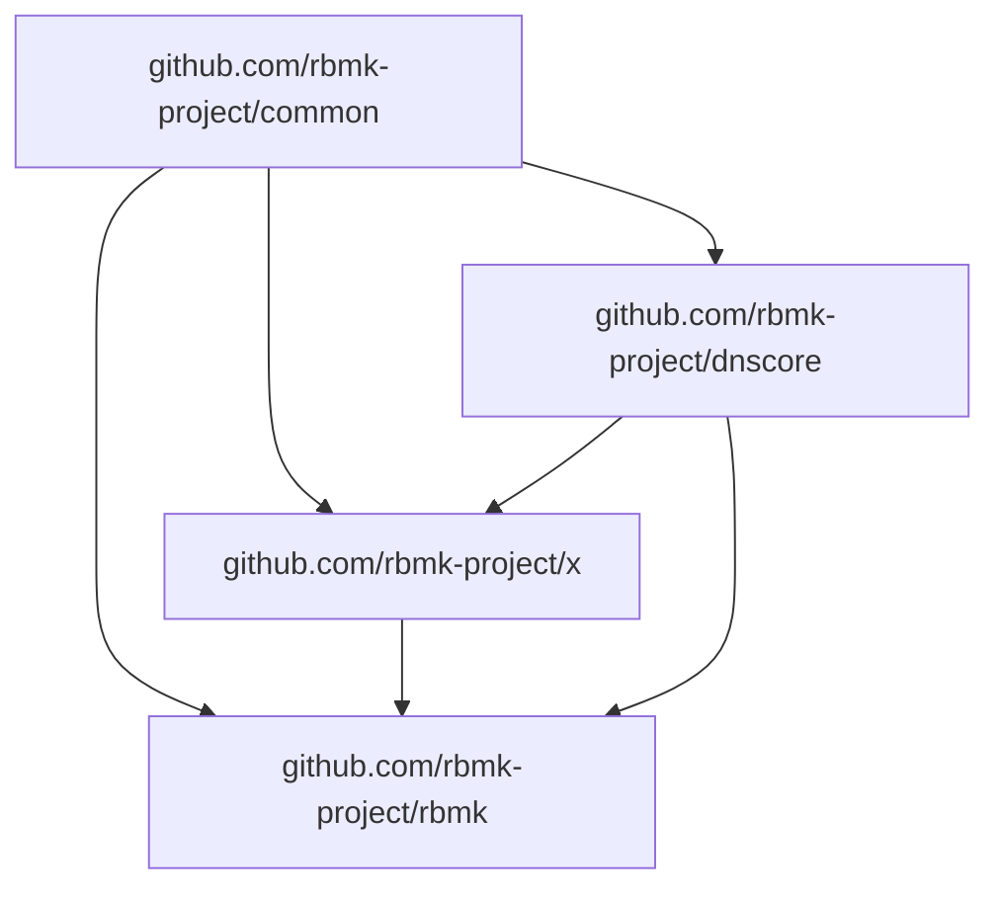

# Really Basic Measurement Kit

Really Basic Measurement Kit (RBMK) is a hobby project by
[@bassosimone](https://github.com/bassosimone) that aims to
create a minimal network measurement engine and basic
command line tools to measure web censorship and performance.

## Architecture

RBMK is written in Go. The following diagram illustrates
the dependencies between RBMK repositories:

Where:

- [common](https://github.com/rbmk-project/common) contains common, shared libraries
- [dnscore](https://github.com/rbmk-project/dnscore) contains the core DNS implementation
- [x](https://github.com/rbmk-project/x) contains experimental libraries
- [rbmk](https://github.com/rbmk-project/rbmk) contains the code for the `rbmk` command line tool
